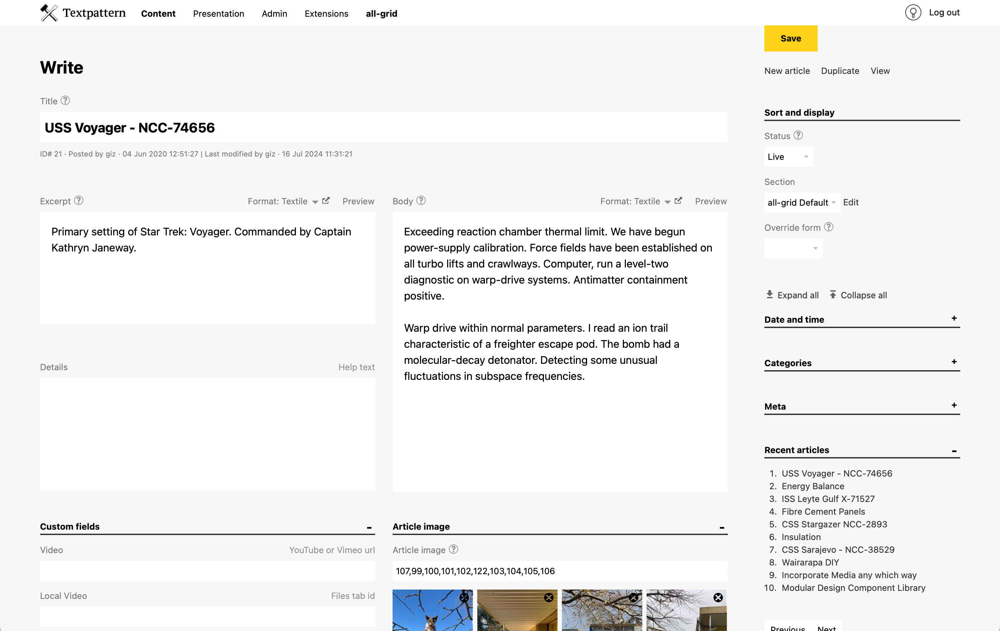
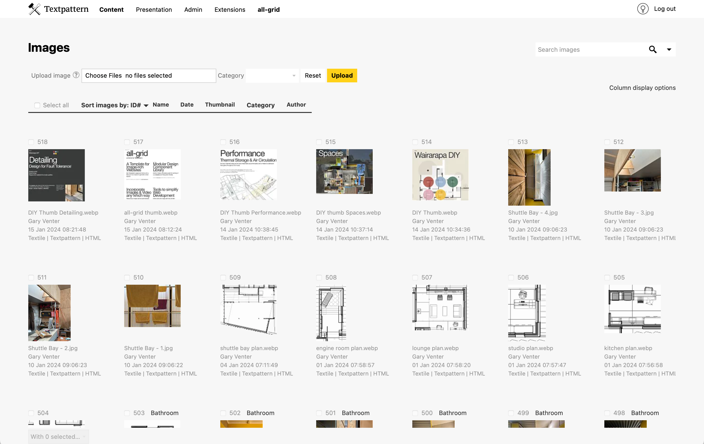
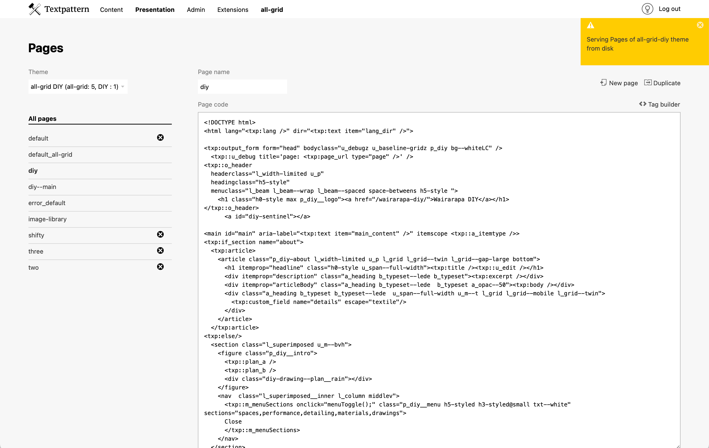
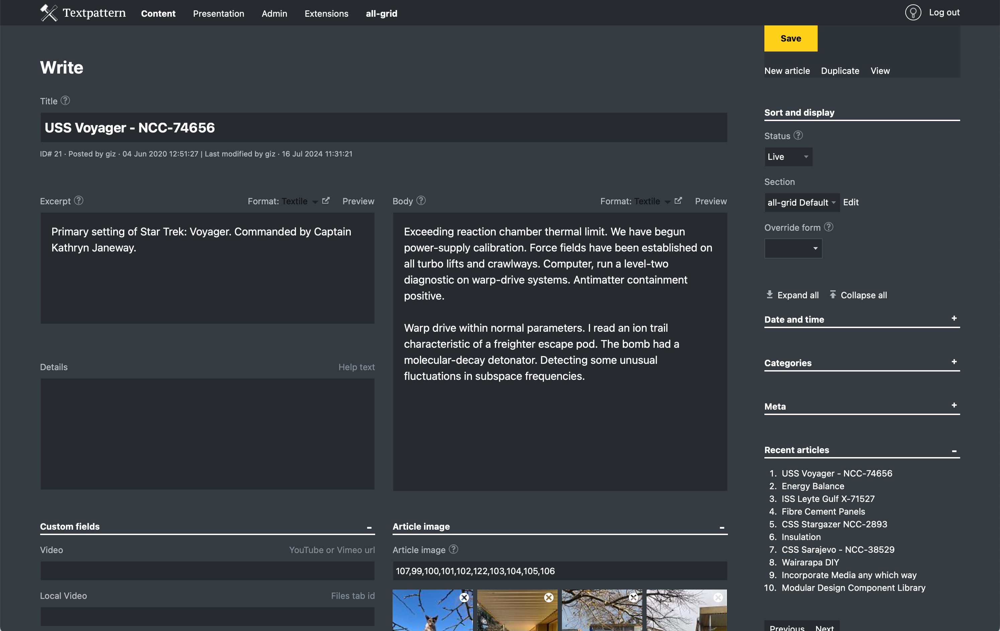

# all-admin

A Textpattern admin-theme that rearranges the layout, screen-size permitting:
* **Write Tab** with a wider, twin-column main area containing:
    * Excerpt before
    * Multiple textareas (if using glz_custom_fields)
    * Custom fields
    * Article images
* **Images Tab (list)** full width, entries in rows. Thumbnail resizing controls are hidden so users can't fiddle with the thumbnail sizes. Your preferred thumbnail display height is set via the css.
* **Presentation Tab** full width textareas

Layout changes are handled via css, with a simple jquery call to alter the DOM.  I find this easier (and more reliable) to configure than my prior go-to plugin, [Write Tab Customise](https://github.com/jools-r/bot_wtc).

## UI

Skinning is simplified, with little decorative styling:
* Native checkboxes and radio buttons
* Limited icon-usage
* Textpattern yellow is reserved for buttons that trigger (or prepare for) a database change
* Server success/warning/etc messages are less discrete, displayed at top of the viewport
* Mobile layouts tweaked to fit more content

